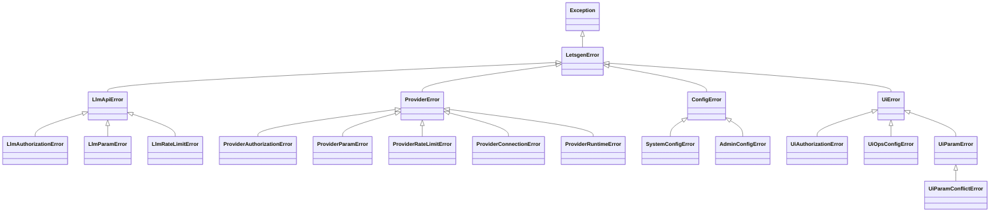

# Error Class Hierarchy

## Class Description

- **LetsgenError**: Base exception class for all application-specific errors

- **LlmApiError**: Base class for LLM API related errors
  - **LlmAuthorizationError**: LLM API authentication/authorization errors
  - **LlmParamError**: Invalid parameters in LLM API calls
  - **LlmRateLimitError**: Letsgen llm api rate limit errors

- **ProviderError**: Base class for LLM provider or inference engine errors
  - **ProviderAuthorizationError**: Authentication errors with LLM providers
  - **ProviderParamError**: Invalid parameters when calling LLM providers
  - **ProviderRateLimitError**: Rate limiting errors from LLM providers
  - **ProviderConnectionError**: Connection issues with LLM providers
  - **ProviderRuntimeError**: Runtime execution errors from LLM providers

- **ConfigError**: Configuration related errors
  - **SystemConfigError**: System configuration errors
  - **AdminConfigError**: Admin backend configuration errors

- **UiError**: UI-related errors with messages intended for frontend display
  - **UiAuthorizationError**: UI authentication/authorization errors
  - **UiOpsConfigError**: UI operation errors
  - **UiParamError**: UI parameter errors
    - **UiParamConflictError**: UI parameter conflict errors