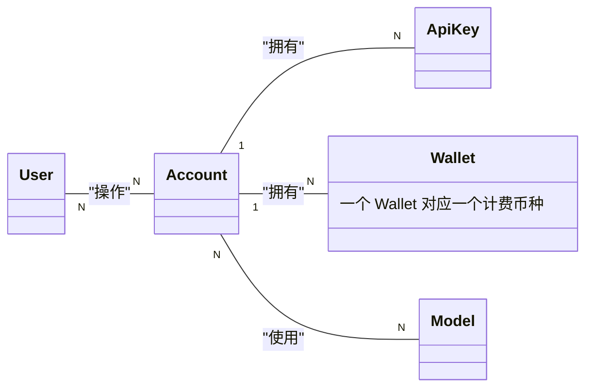
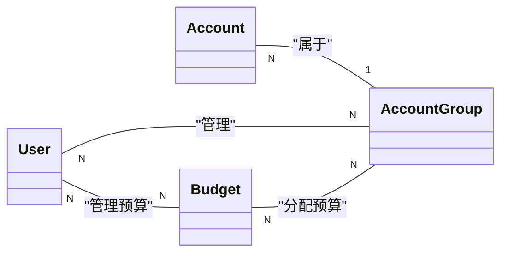
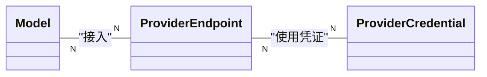

# 关键对象之间的关系

### 普通用户关注

### 普通管理员关注

### 系统管理员关注

# 用户角色

- normal: 普通用户, 创建账户, 创建apikey, 使用模型的权限(api/UI), 为账号充值, 为账号申请模型使用权限
- secure: 安全审计, 配置和修改账户安全策略, 审计用户操作日志
- financial: 财务审计, 创建预算, 审批账户组申请的预算, 审计预算使用情况
- group_admin: 账户组管理员, 管理账户组内的账户, 申请预算, 审批账户充值
- admin: 管理员, 所有权限
