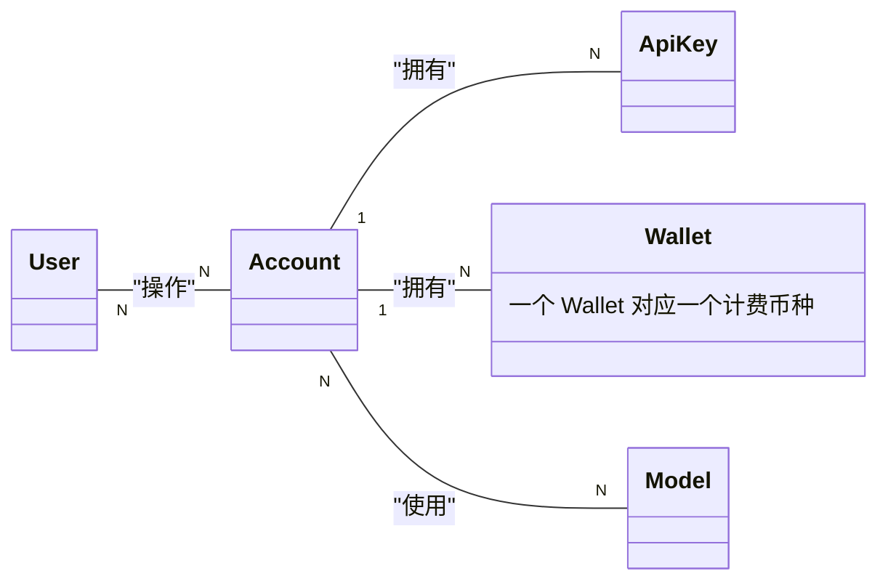

# Key Object Relation

```mermaid
classDiagram
    direction LR

    class User {
    }

    class Account {
    }

    class ApiKey {
    }

    class Wallet {
        一个 Wallet 对应一个计费币种
    }

    class Model {
    }

%% 多对多关系
    User "N" -- "N" Account: "操作"
%% 一对多关系
    Account "1" -- "N" ApiKey: "拥有"
    Account "1" -- "N" Wallet: "拥有"
%% 多对多关系
    Account "N" -- "N" Model: "使用"
```